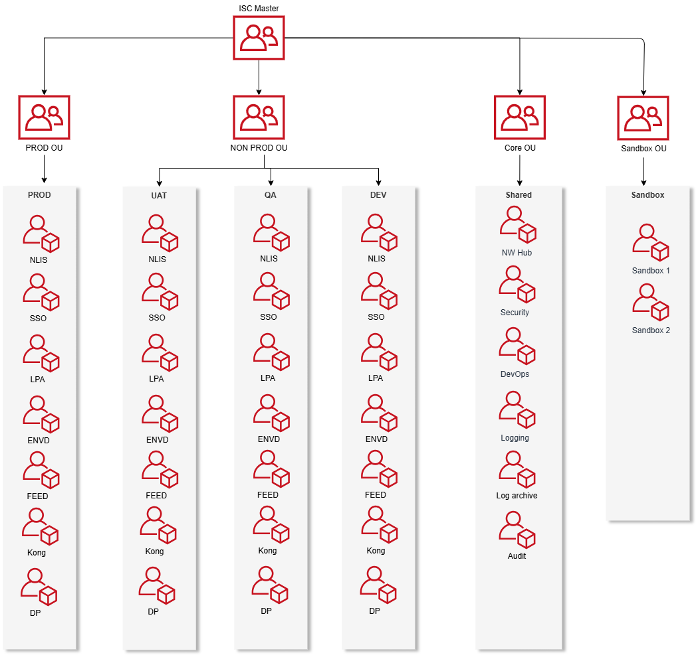

# AWS Organization Architecture

## 1. Purpose

This document defines the **AWS Organization structure** and **multi-account strategy** for the enterprise. It establishes the foundational account hierarchy, governance controls, and security boundaries that enable scalable and secure cloud operations.

---

## 2. Scope

This architecture covers:

* AWS Organization structure and account hierarchy
* Organizational Units (OUs) design and purpose
* Service Control Policies (SCPs) and governance
* Cross-account access patterns and security
* Billing and cost management structure
* Compliance and audit requirements

---

## 3. Architecture Overview



### 3.1 AWS Landing Zone Foundation

The organization is built on **AWS Control Tower** or **AWS Landing Zone** foundation providing:

- **Automated Account Provisioning**: Account Factory for standardized account creation
- **Guardrails**: Preventive and detective controls via SCPs and Config rules
- **Centralized Logging**: CloudTrail, Config, and VPC Flow Logs aggregation
- **Identity Federation**: AWS SSO integration with corporate identity providers
- **Network Foundation**: Shared networking infrastructure and connectivity

### 3.2 Organization Structure

The AWS Organization follows a **hierarchical multi-account strategy** with the following structure:

```
Root Organization
├── Security OU
│   ├── Log Archive Account
│   ├── Audit Account
│   └── Security Tooling Account
├── Core OU
│   ├── Network Account
│   ├── Shared Services Account
│   └── Identity Account
├── Workloads OU
│   ├── Production OU
│   │   ├── Prod Account 1
│   │   └── Prod Account 2
│   ├── Dev OU
│   │   ├── Dev Account 1
│   │   └── Dev Account 2
│   ├── QA OU
│   │   ├── QA Account 1
│   │   └── QA Account 2
│   ├── UAT OU
│   │   ├── UAT Account 1
│   │   └── UAT Account 2
│   └── Sandbox OU
│       ├── Sandbox Account 1
│       └── Sandbox Account 2
└── Suspended OU
    └── (Decommissioned accounts)
```

---

## 4. Account Categories

### 4.1 Account Role Classification

Accounts are categorized by their primary function within the organization:

#### Foundation Accounts
- **Management Account**: Organization root, billing, and governance
- **Security Accounts**: Centralized security services and monitoring
- **Core Infrastructure**: Shared networking, identity, and platform services

#### Workload Accounts
- **Production**: Live customer-facing applications and services
- **Non-Production**: Development, testing, and staging environments
- **Sandbox**: Experimentation and learning environments

#### Specialized Accounts
- **Data Accounts**: Data lakes, analytics, and ML workloads
- **DevOps Accounts**: CI/CD tools and deployment pipelines
- **Disaster Recovery**: Backup and recovery infrastructure

### 4.2 Account Ownership Model
- **Platform Team**: Foundation and core infrastructure accounts
- **Security Team**: All security-related accounts
- **Product Teams**: Workload accounts aligned to business domains
- **Shared Ownership**: Specialized accounts with defined responsibilities

---

## 5. Account Definitions

### 5.1 Management Account (Root)
- **Purpose**: AWS Organization management and billing consolidation
- **Responsibilities**: 
  - Organization-wide policies and SCPs
  - Consolidated billing and cost management
  - Root-level security controls
- **Access**: Highly restricted, break-glass only

### 5.2 Security OU

#### Log Archive Account
- **Purpose**: Centralized log storage and retention
- **Services**: CloudTrail, Config, VPC Flow Logs, GuardDuty findings
- **Retention**: Long-term compliance and audit requirements

#### Audit Account  
- **Purpose**: Security monitoring and compliance validation
- **Services**: Security Hub, Inspector, Trusted Advisor
- **Access**: Security and compliance teams only

#### Security Tooling Account
- **Purpose**: Security tools and incident response
- **Services**: Security scanning tools, forensics, threat detection
- **Access**: Security operations team

### 5.3 Core OU

#### Network Account
- **Purpose**: Centralized networking and connectivity
- **Services**: Transit Gateway, Direct Connect, VPN, DNS
- **Connectivity**: Hub for all account networking

#### Shared Services Account
- **Purpose**: Common services across the organization
- **Services**: Active Directory, DNS, monitoring tools
- **Access**: Platform and operations teams

#### Identity Account
- **Purpose**: Identity and access management
- **Services**: AWS SSO, identity providers, federation
- **Access**: Identity management team

### 5.4 Workloads OU

#### Production OU
- **Purpose**: Live production workloads
- **Controls**: Strict SCPs, change control, monitoring
- **Access**: Production support teams only

#### Dev OU
- **Purpose**: Development and feature testing environments
- **Controls**: Moderate SCPs, automated provisioning, cost controls
- **Access**: Development teams and DevOps

#### QA OU
- **Purpose**: Quality assurance and integration testing
- **Controls**: Moderate SCPs, test data management, automated testing
- **Access**: QA teams and test automation

#### UAT OU
- **Purpose**: User acceptance testing and pre-production validation
- **Controls**: Production-like SCPs, change control, monitoring
- **Access**: Business users, UAT teams, and release managers

#### Sandbox OU
- **Purpose**: Experimentation and learning
- **Controls**: Minimal SCPs, cost controls
- **Access**: Developers and architects

---

## 6. Service Control Policies (SCPs)

### 6.1 Organization-Wide Policies
- Deny root user access (except break-glass)
- Enforce encryption in transit and at rest
- Require MFA for console access
- Prevent deletion of CloudTrail logs
- Restrict region usage to approved regions

### 6.2 Production-Specific Policies
- Deny instance termination without approval
- Require resource tagging
- Prevent public S3 buckets
- Enforce backup policies
- Restrict high-cost instance types

### 6.3 Dev-Specific Policies
- Cost controls and resource limits
- Automated resource cleanup
- Limited production service access
- Development tool permissions

### 6.4 QA-Specific Policies
- Test data management controls
- Automated testing permissions
- Limited external connectivity
- Test environment isolation

### 6.5 UAT-Specific Policies
- Production-like security controls
- Business user access permissions
- Change control requirements
- Data privacy protections

### 6.6 Sandbox-Specific Policies
- Cost controls and spending limits
- Prevent access to production networks
- Auto-shutdown of resources
- Limited service permissions

---

## 7. Cross-Account Access

### 7.1 Identity and Authentication

#### Single Sign-On (SSO)
- **Primary Method**: AWS SSO (Identity Center) for all human access
- **Identity Source**: Corporate Active Directory or external IdP (SAML/OIDC)
- **MFA Enforcement**: Required for all console and CLI access
- **Session Duration**: Time-limited sessions with automatic expiry

#### Access Patterns
- **Human Access**: AWS SSO with federated identity
- **Service Access**: Cross-account IAM roles with trust relationships
- **Emergency Access**: Break-glass procedures with audit logging
- **API Access**: Temporary credentials via STS assume role

### 7.2 Access Patterns
- **AWS SSO**: Primary authentication mechanism
- **Cross-Account Roles**: Service-to-service access
- **Resource Sharing**: RAM for shared resources
- **Network Access**: Transit Gateway connectivity

### 7.3 Network Integration Principles
- **Hub-and-Spoke Model**: Network account as central hub via Transit Gateway
- **Account Isolation**: No direct network peering between workload accounts
- **Shared Services Exception**: Only Shared Services Account accessible for specific services
- **Zero Trust**: No implicit trust between accounts or environments
- **Centralized Connectivity**: All external connections through Network account
- **Service-Based Access**: Network access granted per specific service requirement

### 7.4 Cross-Account Network Access
- **Network Isolation**: No direct network peering between workload accounts
- **Shared Services Only**: Network connectivity permitted only to Shared Services Account
- **Service-Specific Access**: Connectivity limited to specific hosted services only
- **Internet Access**: Controlled egress through centralized NAT/proxy in Network account
- **On-Premises**: Single point of connectivity via Network account
- **DNS Resolution**: Centralized DNS with conditional forwarding

### 7.5 Security Controls
- Least privilege access principles
- Time-bound access for elevated permissions
- Audit logging for all cross-account access
- Regular access reviews and certification

---

## 8. Account Vending

### 8.1 Account Vending Machine (AVM)
- **Purpose**: Automated, self-service account provisioning
- **Implementation**: AWS Control Tower Account Factory or custom solution
- **Integration**: ServiceNow, Jira, or internal portal
- **Approval Workflow**: Automated for sandbox, approval required for production

### 8.2 Account Baseline Configuration
- **Security**: Baseline security controls and monitoring
- **Networking**: VPC setup and Transit Gateway attachment
- **Identity**: SSO integration and role provisioning
- **Compliance**: Config rules and Security Hub enablement
- **Cost Management**: Budget alerts and cost allocation tags

### 8.3 Vending Process
1. **Request Submission**: Via self-service portal or API
2. **Validation**: Business justification and technical requirements
3. **Approval**: Automated or manual based on account type
4. **Provisioning**: Account creation and baseline deployment
5. **Handover**: Credentials and documentation delivery
6. **Monitoring**: Ongoing compliance and cost tracking

### 8.4 Account Types and Templates
- **Production**: Full security controls, change management
- **Development**: Moderate controls, cost limits
- **QA/UAT**: Test-specific configurations
- **Sandbox**: Minimal controls, auto-cleanup
- **Security**: Enhanced monitoring and logging

---

## 8. Governance and Compliance

### 8.1 Account Lifecycle
- **Provisioning**: Automated through Account Vending Machine
- **Configuration**: Baseline security and compliance settings
- **Monitoring**: Continuous compliance validation
- **Decommissioning**: Secure account closure process

### 8.2 Compliance Framework
- **Standards**: ISO 27001, SOC 2, PCI DSS (as applicable)
- **Monitoring**: AWS Config rules and Security Hub
- **Reporting**: Automated compliance dashboards
- **Remediation**: Automated where possible, manual escalation

---

## 9. Cost Management

### 9.1 Billing Structure
- **Consolidated Billing**: All accounts under management account
- **Cost Allocation**: Tags and account-based tracking
- **Budgets**: Account and service-level budget alerts
- **Optimization**: Regular cost reviews and rightsizing

### 9.2 Cost Controls
- **Sandbox Limits**: Monthly spending caps
- **Production Monitoring**: Anomaly detection
- **Reserved Instances**: Centralized purchasing strategy
- **Savings Plans**: Organization-wide optimization

---

## 9. Document Control

| Field | Value |
|-------|-------|
| **Owner** | <Your Name>, Enterprise Architect |
| **Team** | <Your Team Name> |
| **Contact** | <your.email@company.com> |
| **Current Version** | 1.0 |
| **Applies To** | All AWS accounts and services |

## 10. Change Log

| Version | Date | Author | Description |
|---------|------|--------|--------------|
| 1.0 | 2024-01-15 | <Your Name> | Initial version - AWS Organization architecture design |

---

## 11. References

- [AWS Organizations Best Practices](https://docs.aws.amazon.com/organizations/latest/userguide/orgs_best-practices.html)
- [AWS Control Tower](https://docs.aws.amazon.com/controltower/)
- [AWS Landing Zone](https://aws.amazon.com/solutions/implementations/aws-landing-zone/)
- Enterprise Architecture Principles Document