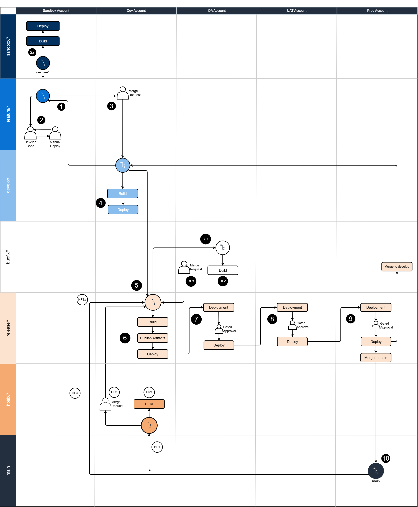

# DevOps Release Process

## Purpose
The purpose of this document is to establish a multi-account DevOps strategy for releasing infrastructure and application code. All code deployments must follow this process to ensure consistency, quality, and compliance across AWS environments.

## Context
This multi-account DevOps release strategy addresses critical enterprise requirements:

1. **Keep Accounts in Consistent State**: Enforces code-based deployments through standardized pipelines, eliminating configuration drift from manual changes

2. **Ensure Auto Documentation and Tracking**: Provides automatic documentation and tracking of all changes introduced by new features and implementations through version control, pipeline logs, and audit trails

3. **Centralized Governance, Decentralized Delivery**: Centrally defined guardrails (branch protection, approval gates) with team autonomy for delivery within approved boundaries

4. **Standardized Deployment and Release Mechanism**: Consistent CI/CD pipeline patterns across all teams and projects for predictable, repeatable deployments

5. **Ensure Security by Design**: Built-in approval gates, automated security scanning in pipelines, and least privilege access controls

6. **Audit Trail and Visibility of Deployment**: Complete traceability from code commit to production deployment with pipeline execution logs and automated audit trails

### Alignment with Architecture Principles

This DevOps release process directly supports and achieves the following enterprise architecture principles:

- **Automation by Default**: All deployments automated through CI/CD pipelines; manual changes in managed environments prohibited
- **Account-Level Isolation**: Separate accounts for each SDLC environment (Sandbox, Dev, QA, UAT, Production) with controlled promotion paths
- **Environment Parity**: Consistent architecture patterns across all environments with promotion through pipelines, not redeployment
- **Centralised Governance, Decentralised Delivery**: Guardrails centrally defined and enforced; teams self-service within approved boundaries
- **Security by Design**: Security controls built into platform and enabled by default through pipeline automation
- **Observability is Mandatory**: Pipeline execution logs, audit trails, and deployment tracking provide full visibility

## Applicability
This standard applies to:
- All solution teams deploying code to AWS environments
- All projects using the enterprise SDLC environments (Sandbox, Dev, QA, UAT, Production)
- Both new projects and existing projects transitioning to the standard

## When to Use
- When deploying any code changes to AWS environments
- When setting up CI/CD pipelines for new projects
- When onboarding new team members to the deployment process
- When planning release schedules and deployment windows

## Scope
Applies to all code deployments including:
- Application code (Java, Python, Node.js, etc.)
- Infrastructure-as-code (Terraform, CloudFormation, CDK)
- Configuration management code
- Automation scripts
- Database scripts
- Operational automation code

## Overview
The release process follows a progressive deployment model across five standard SDLC environments (Sandbox, Dev, QA, UAT, and Production) with automated CI/CD pipelines and approval gates. This aligns with our enterprise SDLC standards and defines how to work with different environments and release code.



## AWS Account Structure

| Environment | AWS Account | Purpose | Console Write Access | Deployment Type |
|------------|-------------|---------|---------------------|----------------|
| Sandbox | Sandbox Account | Individual testing & experimentation | Yes (DevOps teams) | Manual |
| Dev | Dev Account | Integration testing | No (Bitbucket pipeline only) | Automated |
| QA | QA Account | Quality assurance & bug fixes | No (Bitbucket pipeline only) | Automated |
| UAT | UAT Account | User acceptance testing | No (Bitbucket pipeline only) | Automated with approval |
| Production | Prod Account | Live production workloads | No (Bitbucket pipeline only) | Automated with approval |

### Access Control Policy

**Least Privilege Principle**: Console write access is restricted on Dev, QA, UAT, and Production accounts to maintain environment consistency and enforce infrastructure-as-code practices.

**Rationale**:
- Prevents configuration drift from manual changes
- Ensures all changes are tracked and auditable through version control
- Maintains environment consistency and reproducibility
- Enforces code review and approval processes
- Provides complete audit trail for compliance

**Sandbox Account**: DevOps teams have console write access to test and validate infrastructure-as-code (IaC) and CDK code before formal deployment. This allows experimentation and rapid iteration without impacting controlled environments.

## Branch Strategy & Deployment Flow

## Environment Flow

```
Sandbox → Dev → QA → UAT → Production
```

## Branch to Environment Mapping

| Branch Type | Target Environment(s) | Deployment Method |
|------------|----------------------|-------------------|
| sandbox/* | Sandbox | Manual |
| feature/* | Sandbox | Manual |
| develop | Dev | Automated (Bitbucket pipeline) |
| bugfix/* | QA | Automated (Bitbucket pipeline) |
| release/* | QA → UAT → Production | Automated (Bitbucket pipeline with approval gates) |
| hotfix/* | All (expedited) | Automated (Bitbucket pipeline with expedited approval) |
| main | Production (merge only) | N/A (receives merges only) |

## Deployment Workflow Integration

1. **Development Phase**: Developers work on feature/* branches and test manually in Sandbox
2. **Integration Phase**: Merged code automatically deploys to Dev via develop branch
3. **Testing Phase**: Release branches automatically deploy to QA for systematic testing
4. **Acceptance Phase**: After QA approval, release branches automatically deploy to UAT
5. **Production Phase**: After UAT approval and manual approval gate, release branches deploy to Production

## Environment Flow

```
Sandbox → Dev → QA → UAT → Production
```

## Standard Deployment Workflow

### Normal Release Cycle
```
1. feature/* → Manual deploy to Sandbox → Test and iterate IaC/CDK code
2. feature/* → Finalize code → Pull Request → develop
3. develop → Auto deploy to Dev (Bitbucket pipeline only) → Validate
4. release/* → Auto deploy to QA (Bitbucket pipeline only) → Test
5. release/* → Auto deploy to UAT (Bitbucket pipeline only) → UAT Testing
6. release/* → Approval Gate → Auto deploy to Production (Bitbucket pipeline only)
7. release/* → Merge to main and develop
```

**Key Points**:
- All IaC/CDK code testing and iteration happens in Sandbox with console access
- Once code is finalized in feature branch, raise Pull Request to develop
- Dev, QA, UAT, and Production deployments are Bitbucket pipeline-only (no console write access)
- This ensures all controlled environments remain consistent and auditable

### Hotfix Cycle
```
1. hotfix/* → Branch from main
2. hotfix/* → Expedited review and approval
3. hotfix/* → Deploy through all environments (accelerated)
4. hotfix/* → Merge to main and develop
```


### Bitbucket Pipeline Automation

All automated deployments include:
- Code validation and linting
- Security scanning (SAST, secrets detection)
- Infrastructure validation
- Automated testing
- Deployment to target environment
- Post-deployment validation

Pipeline behavior:
- All Bitbucket pipelines include: validation, security scanning, linting, and deployment
- Failed pipeline checks block deployment progression
- Manual approval required for UAT → Production promotion

### Approval Gates

- **Dev**: Pull Request approval only
- **QA**: Automatic deployment from release/* branch
- **UAT**: Automatic deployment after QA validation
- **Production**: Manual approval gate required (Technical Lead + Solution Architect)

### Branch Protection Rules
- **main**: No direct commits, requires release/* or hotfix/* merge
- **develop**: No direct commits, requires Merge Request approval
- All other branches: Follow team code review standards

## Key Principles

- **Progressive Deployment**: Changes flow through SDLC environments sequentially
- **Automated CI/CD**: Deployments from develop onwards are automated
- **Approval Gates**: Production requires manual approval
- **Code-Based Changes**: All changes must be code-based (no manual changes)
- **Environment Alignment**: Follows enterprise SDLC environment standards
- **Traceability**: Every deployment tracked through pipeline with audit logs

## Support & Exceptions

For questions or exception requests, contact:
- **DevOps Team**: [Contact Details]
- **Enterprise Architecture Team**: [Contact Details]

Exception requests require approval from Enterprise Architecture team.

## Related Documents

- [DevOps Environments](devops-environments.md) - Detailed environment descriptions, access controls, and compliance requirements
